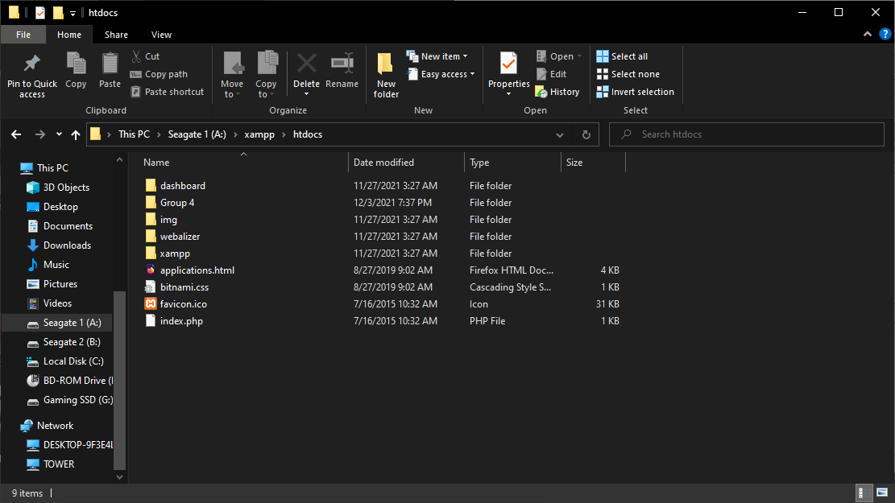
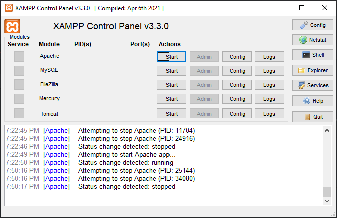

# COSC-4351-Group-6
Group project for COSC 4351

How to run:
Download the proper version of XAMPP in order to be run on your system at [XAMPP](https://www.apachefriends.org/index.html)  
Note down your install folder location it will be named Xampp and navigate to the htdocs inside of the installation folder (ie for me A:\xampp\htdocs)  

Once inside xampp -> htdocs folder download the "Final" folder from our github repo and place it inside of the htdocs folder.  
Once the folder has been place start XAMPP. Once the application has started select start for the Apache module.  

Now that the module is running you can open your web browser and go to localhost/Final/index.php  
If you wish to view the database go to localhost/Final/select.php  

Group members:
Mohammed raihan kapadia,
Stephany Monroy,
Nicholas moore  

Project:
Website for group 6 project in cosc 4351  
